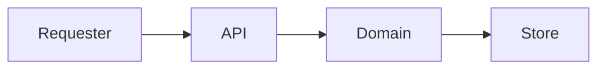
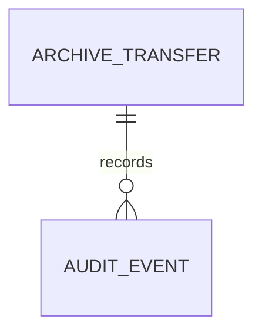
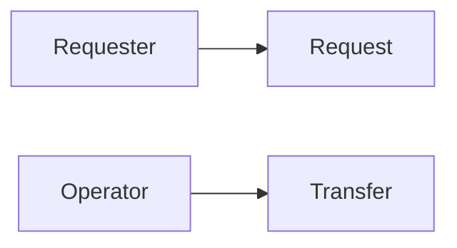
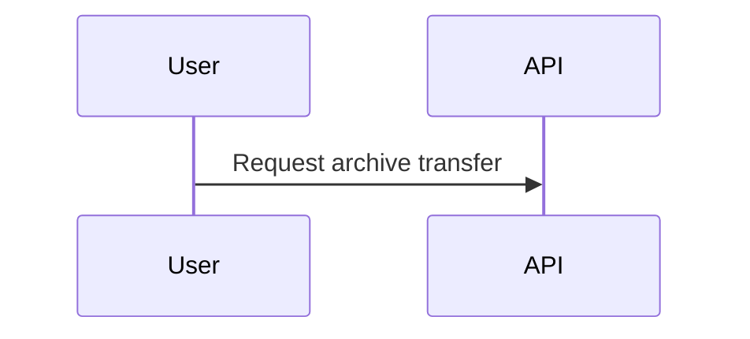

# Supplier Evidence Access Archive Transfer Control Platform

## The Problem

Supplier evidence archival transfers can lose provenance when destinations, retention purposes, approvals, and transfer confirmation are not governed in one record.

## The Solution

This service governs archive transfers through review, authority approval, operator transfer confirmation, and assurance closure with role checks, ordered transitions, audit events, and atomic persistence.

## Live Demo and Tech Stack

The service runs on `http://localhost:65507/health` with Node.js, Express, atomic JSON persistence, Vitest, and GitHub Actions.

## Local Setup and Run Instructions

```bash
npm install
npm test
npm start
```

## System Documentation

### System Architecture Diagram


### Entity-Relationship Diagram


### Data Flow Diagram


### Use Case Diagram


### Sequence Diagram


## Owner

Created and maintained by Kholipha Ahmmad Al-Amin.

Software Engineer and AI Specialist

Founder and CEO of EquiSaaS BD

Principal Consultant at AR IT Consultancy

Full Stack Developer and SaaS Product Builder

### Official links

Portfolio: https://kholipha-ahmmad-al-amin.equisaas-bd.com/

GitHub: https://github.com/kholipha-ahmmad-al-amin

LinkedIn: https://www.linkedin.com/in/kholipha-ahmmad-al-amin

X: https://x.com/al_amin5519

Facebook: https://www.facebook.com/kholipha.ahmmad.al.amin

Instagram: https://www.instagram.com/kholipha.ahmmad.al.amin

## Ownership

This project was created and is maintained by Kholipha Ahmmad Al-Amin.
